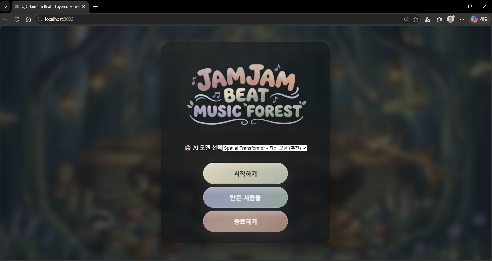
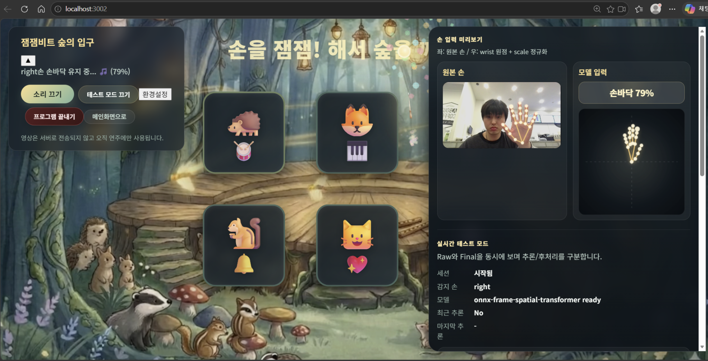
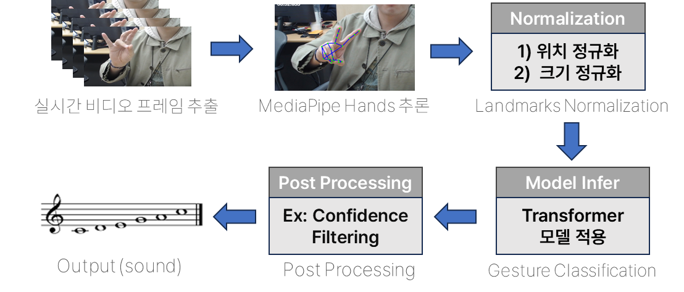
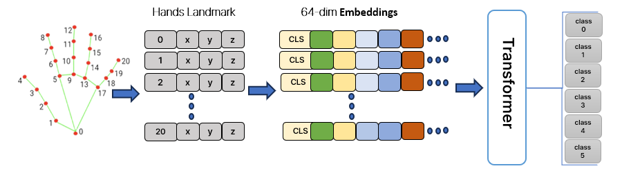

# JamJamBeat

손 제스처를 실시간으로 인식하여 소리와 상호작용할 수 있도록 설계한 AI 기반 인터랙티브 프로젝트

> **프로젝트 개요**: MediaPipe Hands로 추출한 21개 손 랜드마크를 기반으로 제스처를 분류하고, 브라우저 환경에서 실시간 추론이 가능하도록 최적화한 시스템입니다. 이미지 전체를 직접 처리하는 방식보다 경량화된 랜드마크 기반 접근을 사용하여 실시간성과 효율성을 높이는 데 중점을 두었습니다.

---

## 스크린샷

## 📸 스크린샷

<table>
  <tr>
    <td align="center" width="50%">
      <br/>
      <sub><b>메인 화면</b></sub>
    </td>
    <td align="center" width="50%">
      <br/>
      <sub><b>제스처 인식 화면</b></sub>
    </td>
  </tr>
</table>

## 시스템 흐름

<p align="center">
  
</p>

<p align="center"><sub><b>전체 시스템 흐름</b></sub></p>

---

## 📺 서비스 시연 영상

[](https://www.youtube.com/watch?v=VIDEO_ID)

*이미지를 클릭하면 시연 영상으로 이동합니다.*  
---

## 주요 기능



*JamJamBeat 전체 파이프라인 구성도: 랜드마크 추출, 전처리, 모델 추론, 후처리, 브라우저 상호작용 흐름을 나타냅니다.*

### 🔹 핵심 기능

- **손 랜드마크 기반 실시간 제스처 인식**
  - MediaPipe Hands를 활용해 손의 **21개 랜드마크(x, y, z)** 를 추출
  - 이미지 전체를 직접 분류하지 않고 랜드마크만 입력으로 사용하여 **연산량을 줄이고 실시간성 확보**
  - 브라우저 환경에서 즉시 제스처를 분류할 수 있도록 구성

- **제스처 분류 모델**
  - 손 랜드마크를 기반으로 **7개 클래스**를 분류
  - 클래스 예시:
    - `0`: neutral
    - `1`: fist
    - `2`: open_palm
    - `3`: V
    - `4`: pinky
    - `5`: animal
    - `6`: k-heart
  - 단일 프레임 기반 분류부터 시퀀스 입력 기반 구조까지 비교 실험 수행

- **브라우저 기반 실시간 추론**
  - 학습된 모델을 ONNX 형식으로 변환 후 **ONNX Runtime Web** 기반으로 프론트엔드에서 실행
  - 별도 서버 추론 없이 브라우저에서 직접 동작 가능하도록 설계
  - 추론 요청 간격 제어 및 중복 실행 방지 로직을 통해 안정성 향상

### 🔹 데이터 전처리 및 최적화

- **랜드마크 정규화**
  - Position normalization: 기준 랜드마크를 원점으로 맞춰 손의 위치 차이 보정
  - Distance normalization: 손 크기 및 카메라 거리 차이를 줄이기 위한 스케일 정규화 적용
  - 다양한 전처리 시나리오를 구성하여 성능 비교 실험 수행

- **Downsampling 전략**
  - neutral 클래스의 과도한 비중을 줄이기 위해 downsampling 적용
  - 단순 프레임 제거가 아닌 transition 구간 및 hard negative를 고려한 데이터 구성 실험 수행
  - seq / frame 모드를 분리해 전처리 조건별 결과 비교 가능

- **후처리 기반 안정화**
  - threshold, voting, debounce 등의 후처리 기법을 적용하여 예측값 흔들림 완화
  - 실사용 환경에서 오분류와 반응 지연을 균형 있게 조정

---

## 🚀 핵심 기술 구현 (Technical Focus)

JamJamBeat는 단순한 제스처 분류를 넘어, **실시간 브라우저 추론이 가능한 손 랜드마크 기반 인식 시스템**을 구현하는 데 초점을 두었습니다.

### 🔹 1. 랜드마크 기반 입력 설계
- 이미지 전체를 직접 분류하는 대신 MediaPipe Hands에서 추출한 **21개 랜드마크 좌표**를 입력으로 사용
- 불필요한 시각 정보 처리를 줄여 **경량화와 속도 향상**
- 손의 구조적 관계를 보존하면서 제스처 분류 성능 확보

### 🔹 2. 전처리 파이프라인 자동화
- 원본 CSV 데이터를 기반으로 downsampling, position normalization, distance normalization을 조합한 **시나리오별 전처리 파이프라인 구축**
- 실험 조건별 데이터셋을 자동 생성하고 저장할 수 있도록 구성
- Weights & Biases를 활용해 전처리 결과를 artifact 단위로 관리

### 🔹 3. 다양한 모델 실험 및 성능 비교
- MLP 기반 baseline부터 temporal 구조, transformer 계열 구조까지 비교
- 랜드마크 간 관계를 학습하기 위한 **Spatial Transformer 형태의 구조 실험**
- 클래스 불균형 완화를 위해 Weighted Sampler, Focal Loss 등의 전략 적용

### 🔹 4. 브라우저 실시간 추론 최적화
- ONNX Runtime Web 기반 추론
- 프론트엔드에서 추론이 과도하게 중첩되지 않도록 request scheduling 적용
- 다양한 사용자 환경에서도 동작할 수 있도록 ORT API 탐색 및 fallback 로직 구성

### 🔹 5. 실제 서비스 관점의 문제 해결
- neutral 클래스에서 높은 false positive가 발생하는 문제를 중점적으로 개선
- 입력 정규화 유지, class 0 처리 전략 조정, loss 함수 변경 등을 통해 오분류를 줄이는 방향으로 실험 수행
- 성능뿐 아니라 **레이턴시와 사용자 경험**까지 고려한 시스템 개선 진행

---

## 기술 스택

- **Frontend**: React, Vite
- **Inference**: ONNX Runtime Web, WebAssembly
- **Landmark Extraction**: MediaPipe Hands
- **Model Training**: Python, PyTorch
- **Data Processing**: NumPy, Pandas
- **Experiment Tracking**: Weights & Biases
- **Deployment**: Firebase Hosting
- **Version Control**: Git, GitHub

---

## 설치 및 실행

### 사전 요구사항

- Python 3.10 이상
- Node.js & npm
- 가상환경 도구 (`venv` 또는 `conda`)
- 학습/전처리용 Python 패키지 설치
- 프론트엔드 실행을 위한 npm 환경

---

### 빠른 실행 (Quick Start)

```bash
git clone <YOUR_REPOSITORY_URL>
cd JamJamBeat

JamJamBeat는 브라우저 기반으로 동작하며, ONNX 모델 파일이 필요합니다.
### 1. Python 환경 설정 

```bash
uv sync

### 2. 모델 파일 다운로드

아래 링크에서 ONNX 모델 파일을 다운로드하세요:

- ONNX 모델: [Google Drive 링크]
- ONNX 데이터 파일: [Google Drive 링크]

다운로드한 파일을 아래 경로에 넣어주세요:
frontend/public/runtime_frame_spatial_transformer/
---

### 3. 프론트엔드 실행

```bash
cd frontend

npm install
npm run dev