# 라벨링 가이드라인

---

## 1. 데이터 개요

### 1.1 라벨링 목적
제스처 분류기를 위한 손 제스처 프레임(또는 랜드마크) 라벨링

### 1.2 작업 데이터 설명
제스처를 취하고 있는 손 프레임들

### 1.3 작업 프로세스 요약
영상의 프레임을 보고 제스처 클래스를 분류한다.

---

## 2. 용어 정의

| 용어 | 설명 |
|------|------|
| 라벨(Label) | AI 모델이 학습할 정답 값 (0~6) |
| 랜드마크(Landmark) | 손가락 관절 및 끝점의 좌표 (x, y, z). MediaPipe 기준 0~20번 사용 |
| None 클래스 | 정의된 6종 외 일상 동작, 다른 제스처, 제스처 간 중간 동작(Intermediate) |
| 축 기준(Rotation) | 카메라에 찍힌 시각적 실루엣 기준 (Roll, Pitch, Yaw). 허용 범위 이내일 때만 정답으로 인정 |

---

## 3. 어노테이션 절차

### 3.1 도구 사용법
[data/README.md](../data/README.md) 참조

---

## 4. 공통 라벨링 규칙

### 4.1 시점 기준
- 모든 판단은 카메라에 찍힌 **시각적 형태**를 기준으로 한다 (해부학적 각도 아님)
- 좌/우 방향은 **손의 주인 기준** (카메라에서는 좌우가 반전됨)

### 4.2 가림(Occlusion) 처리
- 가려진 경우, 육안으로 확인할 수 있는 부분만 기준으로 판단한다
- 오답 조건이 명확하게 확인되지 않으면 → **해당 클래스로 라벨링** (strict하지 않은 방향)

### 4.3 축 기준 정의
- **Roll**: 손목 좌우 회전 (시계/반시계 방향)
- **Pitch**: 손목 상하 회전 (위/아래 방향)
- **Yaw**: 손목 앞뒤 회전 (좌우 꺾기)

### 4.4 축별 허용 범위 요약

| 제스처 | Roll | Pitch | Yaw |
|--------|------|-------|-----|
| Fist | ±45° | 상 0~60° | ±30° |
| Openpalm | ±45° | 상 45°↑ | ±30° |
| V | ±45° | 상 45°↑ | ±30° |
| Pinky | 좌 0~+90° | 상 45°↑ | ±30° |
| Animal | 좌 0~+45° | +10°~+45° | ±90° |
| KHeart | 우 +90°~+180° | 0~-45° | ±30° |

---

## 5. 클래스별 라벨링 기준

### 클래스 1 — Fist (주먹)

**기본 형태**
- 손가락 4개와 엄지가 모두 접힌 주먹 형태

**라벨링 불가 조건** (하나라도 해당하면 Fist로 라벨링 불가)
- 다섯 손가락 중 하나라도 펴져 있음
- 네 손가락 중 두 손가락이 손바닥과 전혀 닿지 않고 떨어져 있음
- 엄지 손가락이 네 손가락과 전혀 닿지 않고 떨어져 있음

**Base_positive**

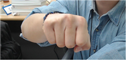

**ROLL — 좌우 ±45° 이하 → 정답**

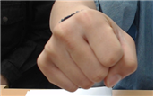 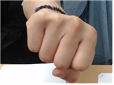

**PITCH — 상 0~60° 이하 → 정답**

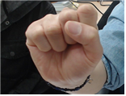

**YAW — ±30° 이하 → 정답**

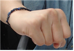 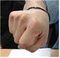

**Negative 케이스** → [TEST전략.pdf](./references/TEST전략.pdf) 의 10p ~ 11p 참조

---

### 클래스 2 — Openpalm (손바닥)

**기본 형태**
- 다섯 손가락이 모두 펴져 있으며, 손가락들이 서로 붙지 않고 펼쳐진 손바닥 형태

**라벨링 불가 조건** (하나라도 해당하면 Openpalm으로 라벨링 불가)
- 손바닥이 전혀 보이지 않음
- 다섯 손가락 중 하나라도 손바닥보다 앞으로 나오거나, 손등보다 뒤로 확실히 빠져 있음
- 다섯 손가락이 모두 붙어 있음

**Base_positive**

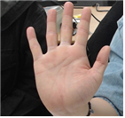

**ROLL — ±45° 이하 → 정답**

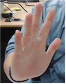

**PITCH — 상 45°↑ → 정답**

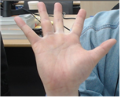

**YAW — ±30° 이하 → 정답**

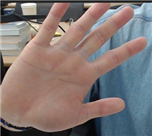

**Negative 케이스** → [TEST전략.pdf](./references/TEST전략.pdf) 의 11p ~ 12p 참조

---

### 클래스 3 — V (브이)

**기본 형태**
- 검지와 중지는 펴져 있고, 약지·소지·엄지는 접혀 있는 V 손동작 형태

**라벨링 불가 조건** (하나라도 해당하면 V로 라벨링 불가)
- 검지, 중지 손가락이 손바닥보다 손가락 맨 끝 마디만큼 확실히 앞으로 나옴
- 측면 관측 시, 검지·중지의 중간 관절(랜드마크 6번, 10번)이 구부러져 있음이 확인됨
- 접혀 있어야 하는 엄지·약지·새끼 손가락 끝(랜드마크 4, 16, 20번) 중 하나라도 x,y 값이 손바닥 범위에서 확실히 떨어져 있음
  - 손바닥 범위: 랜드마크 0, 1, 5, 17번을 기준으로 그리는 사각형

**Base_positive**

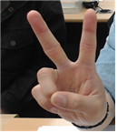

**ROLL — ±45° 이하 → 정답**

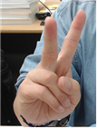

**PITCH — 상 45°↑ → 정답**

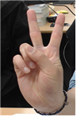

**YAW — ±30° 이하 → 정답**

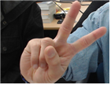 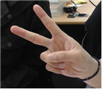

**Negative 케이스** → [TEST전략.pdf](./references/TEST전략.pdf) 의 13p ~ 14p 참조

---

### 클래스 4 — Pinky (약속)

**기본 형태**
- 새끼손가락만 명확히 펴져 있고, 검지·중지·약지·엄지는 접혀 있는 손동작 형태

**라벨링 불가 조건** (하나라도 해당하면 Pinky로 라벨링 불가)
- 엄지 손가락이 세 손가락과 전혀 닿지 않고 떨어져 있음
- 약지 손가락이 중지 손가락의 끝 마디보다 더 높게 뜰 정도로 펴져 있음
- 검지, 중지 손가락 끝이 손바닥과 확실히 떨어져 있음
- 새끼 손가락이 다른 손가락(약지)과 닿아 있음

**Base_positive**

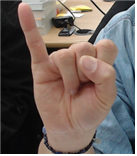

**ROLL — 좌 0~+90° 이하 → 정답**

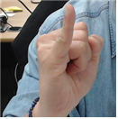

**PITCH — 상 45°↑ → 정답**

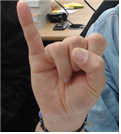

**YAW — ±30° 이하 → 정답**

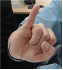

**Negative 케이스** → [TEST전략.pdf](./references/TEST전략.pdf) 의 14p ~ 15p 참조

---

### 클래스 5 — Animal (여우손)

**기본 형태**
- 검지와 새끼손가락은 펴져 있고, 중지·약지·엄지는 접혀 있는 손동작 형태

**라벨링 불가 조건** (하나라도 해당하면 Animal로 라벨링 불가)
- 엄지·중지·약지의 손 끝 중 하나라도 서로 맞닿아 있지 않음

> 검지, 새끼 손가락의 구부림 정도는 판단하지 않는다. 단, 검지·새끼 손가락 끝이 다른 손가락들과 닿으면 안 된다.

**Base_positive**

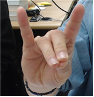

**ROLL — 좌 0~+45° 이하 → 정답**

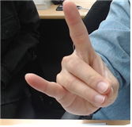

**PITCH — +10°~+45° → 정답**

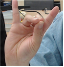

**YAW — ±90° 이하 → 정답**

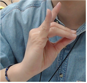

**Negative 케이스** → [TEST전략.pdf](./references/TEST전략.pdf) 의 16p ~ 17p 참조

---

### 클래스 6 — KHeart (손가락하트)

**기본 형태**
- 엄지손가락과 검지손가락의 끝이 맞닿아 하트 모양을 형성하고, 중지·약지·새끼는 접혀 있는 손동작 형태

**라벨링 불가 조건** (하나라도 해당하면 KHeart로 라벨링 불가)
- 엄지 손가락과 검지 손가락이 확실히 떨어져 있음
- 엄지 손가락의 끝(손톱 제외) 부분이 검지 손가락 너머로 화면에서 육안 상으로 확인이 되지 않음
- 중지·약지·새끼 손가락 중 하나라도 손가락 끝이 손바닥과 확실히 떨어져 있음

**Base_positive**

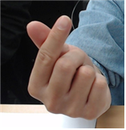

**ROLL — 우 +90°~+180° → 정답**

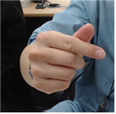

**PITCH — 0~-45° → 정답**

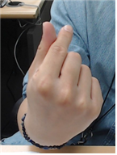

**YAW — ±30° 이하 → 정답**

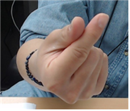

**Negative 케이스** → [TEST전략.pdf](./references/TEST전략.pdf) 의 17p ~ 18p 참조

---

## 6. None 클래스

None 클래스는 프로젝트에서 정의한 제스처(Fist, Openpalm, V, Pinky, Animal, KHeart)에 속하지 않는 손동작을 의미한다.

### 6.1 아무 동작 아님
특정 제스처를 의도하지 않은 일상적인 손동작

예시: 코 만지기, 턱 괴기, 책/펜/컵 잡기, 자연스럽게 힘 빠진 손

### 6.2 다른 제스처
프로젝트에서 정의하지 않았으나 독립적인 의미를 가지는 손 제스처, 또는 정의한 클래스와 유사한 손 제스처

각 클래스별 오답(negative) 예시:

| 케이스 | 설명 |
|--------|------|
| fist_roll_negative | ±45° 초과 roll |
| fist_PITCH_negative | 하 45° 이상 pitch |
| fist_similar_negative | Thumb-up |
| Openpalm_roll_negative | ±45° 초과 roll |
| Openpalm_PITCH_negative | 0°~-45° 이상 pitch |
| Openpalm_YAW_negative | ±30° 초과 yaw |
| Openpalm_Similar_negative | 다섯 손가락 붙임 |
| V_ROLL_negative | ±45° 초과 roll |
| V_PITCH_negative | 0°~-45° 이상 pitch |
| V_Similar_negative1 | 손가락 구부림 (90° 이하) |
| V_Similar_negative2 | 추가 손가락 펼침 |
| Pinky_ROLL_negative | 90° 초과 roll |
| Pinky_PITCH_negative | 0°~-45° 이상 pitch |
| Pinky_YAW_negative | ±30° 초과 yaw |
| Pinky_Similar_negative1 | 새끼 외 다른 손가락 편 동작 |
| Pinky_Similar_negative2 | 엄지도 같이 편 동작 |
| Animal_ROLL_negative | 45° 초과 roll |
| Animal_PITCH_negative | 45° 초과 pitch |
| Animal_YAW_negative | ±90° 초과 yaw |
| Animal_Simila_negative | 피스 동작 |
| K-heart_ROLL_negative | 90° 초과 roll |
| K-heart_PITCH_negative | +45° 초과 pitch |
| K-heart_YAW_negative | ±30° 초과 yaw |
| K-heart_Similar_negative | 엄지·검지 간격 벌어짐 (거리 단계) |

### 6.3 중간 동작
정의된 제스처를 수행하는 과정에서 나타나는 비완성 또는 전환 중 상태의 손동작

> 레벨2 단계에서 진행 예정