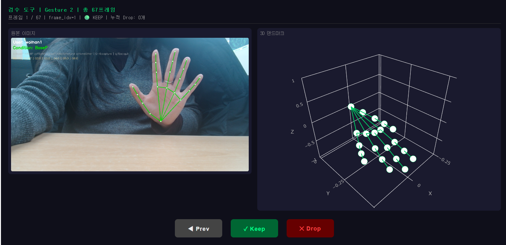

# 테스트셋 데이터 수집 도구

## 실행방법 

> 윈도우 하위 리눅스 가상환경(WSL) 세팅일 시 
> 윈도우에 git clone 해서 사용하는 것을 권장드립니다.


```bash
# 가상환경 활성화
uv sync

# 데이터 수집
uv run python data/testset/capture.py

# 데이터 검수 (gesture 번호 필수)
uv run python data/testset/review.py --gesture 1

```

## 데이터 수집

### 1. Condition 단축키 선택

| 단축키 | Condition |
| --- | --- |
| b | BaseP |
| r | RollP |
| p | PitchP |
| y | YawP |
| n | NoneNetural |
| o | NoneOther |

### 2. 0~6 클래스의 번호 선택
> 키보드 오른쪽 숫자 패드는 사용 불가능 할 수 있습니다.

### 3. esc / q 로 종료
> ctrl+c 로 종료시 csv 파일이 저장되지 않습니다.

## 데이터 검수


### 1. keep / drop 선택

### 2. 마지막 프레임에서 keep/drop 클릭 시 후처리가 자동 실행됩니다.
> prev, keep, drop 버튼 아래에 검수가 완료되었다는 메세지가 출력된다.
